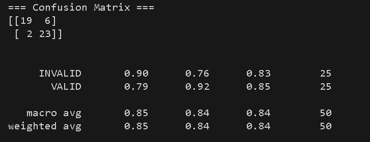
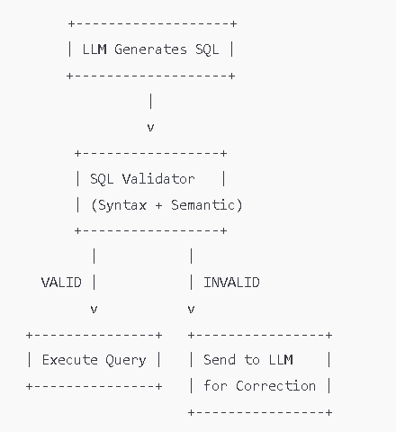

# NextMove SQL Validator – Initial Report

## 1. Overview

The SQL Validator in NextMove checks the correctness of SQL queries. It performs:

- **Syntax validation** using sqlglot
- **Semantic validation** against source schemas
- **Dialect adaptation** for MySQL and PostgreSQL
- **Warnings** for risky operations (e.g., `SELECT *`, `UPDATE/DELETE` without `WHERE`)
- A **federated validator** supports multi-source queries via GAV mappings and source-specific tables.

## 2. Dataset

- **Source**: CSV file with 50+ LLM-generated SQL queries
- **Columns**: `SQL_QUERIES`, `STATUS` (VALID/INVALID), `SCHEMAS`

## 3. Validation Performance

| **Metric**            | **Value**                          |
|-----------------------|------------------------------------|
| Accuracy              | 0.84                               |                 |
| F1-Score              | INVALID: 0.83, VALID: 0.85         |
| **Observations**      | Majority of VALID queries detected; false negatives mainly due to typos, aliases, and `SELECT *` |

## 4. Known Limitations

- **No fuzzy matching**: Minor typos in table/column names lead to invalid flags.
- **Aliases**: Table aliases in joins/subqueries may fail validation.
- **SELECT *** : Triggers warnings, affecting some classifications.

## 5. Workflow

- **Invalid queries** are sent back to the LLM for correction.
- **Corrected queries** re-enter the validator, ensuring pipeline continuity.

## 6. Validation Workflow

The validator processes each SQL query through multiple layers of checks:

### Step 1 – Empty Query Check

- Ensures the query is non-empty.
- Empty or whitespace-only queries are immediately rejected.

### Step 2 – Syntax Parsing (via sqlglot)

- Parses the SQL query using the sqlglot parser.
- If parsing fails (due to incorrect syntax, tokens, or unsupported constructs), the query is marked invalid.

### Step 3 – Structural Checks

- Verifies essential SQL constructs:
  - `SELECT` must include a `FROM` clause.
  - `UPDATE` must specify a target table.
  - `DELETE` must reference a table.
  - `INSERT` must include non-empty `VALUES`.
- These checks catch common logical mistakes early.

### Step 4 – Semantic Validation (Schema-Aware)

- If schema definitions are available, the validator ensures:
  - All tables referenced in the query exist in the schema.
  - All columns used belong to the referenced tables.
  - Table aliases and their column mappings are valid.
- If semantic errors are found, the query is marked invalid even if syntactically correct.

### Step 5 – Warning Generation

- The validator flags potentially risky but syntactically valid operations, such as:
  - `UPDATE` or `DELETE` without a `WHERE` clause.
  - `SELECT *` (performance risk).
  - Missing semicolon at the end of a query (style issue).
- Warnings do not invalidate a query — they serve as advisory notes.

### Step 6 – Result Compilation

- Each validation produces a structured JSON-like output with:
  - `is_valid` (True/False)
  - `errors` (detailed list)
  - `warnings` (non-critical suggestions)
  - `query_type` (SELECT, UPDATE, etc.)
  - `parsed_tree` (pretty-printed SQL syntax tree)

## 7. Conclusion

- Achieved **84% accuracy** on diverse LLM-generated queries.
- Provides a strong starting point for query validation.
- Future improvements (fuzzy matching, alias resolution, improved warnings) are expected to increase accuracy further.